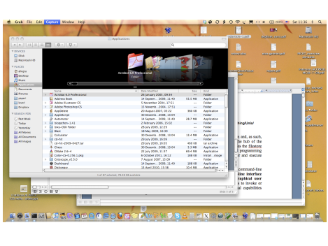
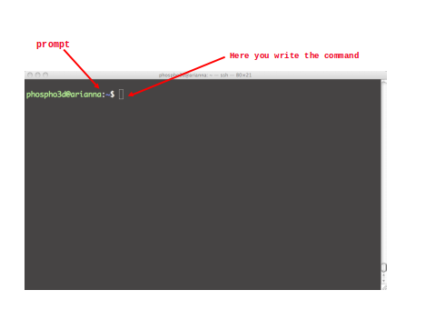
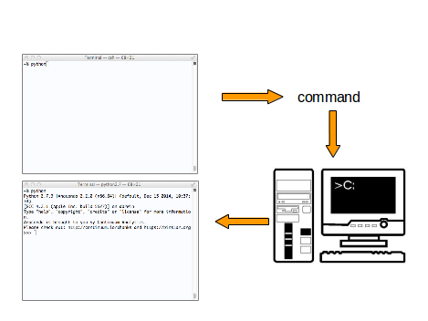
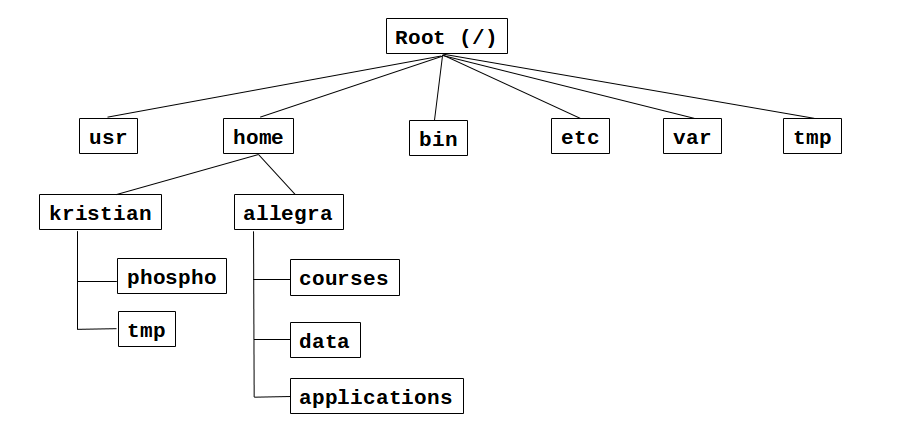
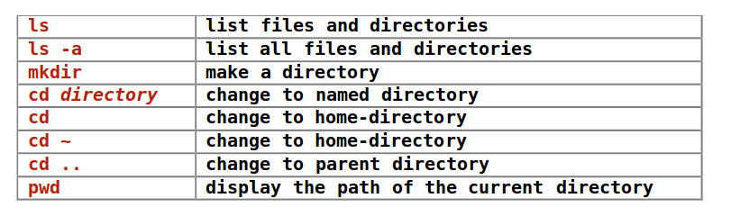
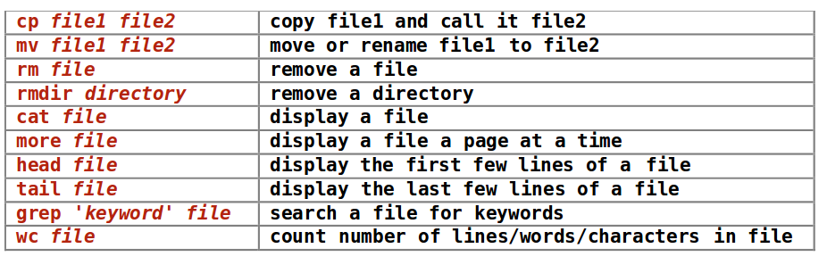
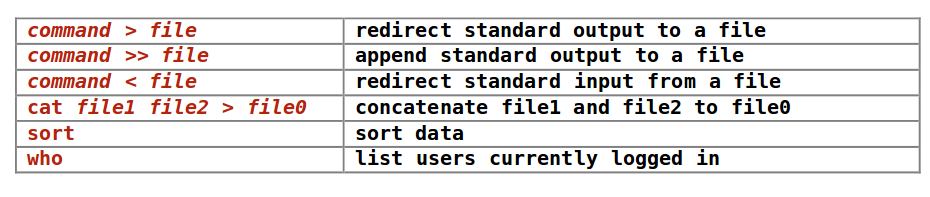

# What is Unix/Linux?


> ### What operating system(s) 
> ### do you know?

---

## What is the computer shell?
The shell is an interpreter (a program) that lets you interact with the operating system


---

## The Linux shell

-   The shell is a command-line interpreter that lets you interact with Linux
-   The shell takes what you type and "decides" what to do with it
-   The shell is actually a scripting language somewhat like Python
-   It is always possible to change shell (either temporarily or permanently)


---

## What is the graphical interface?



---

## What is the command line interface 
## (or Terminal)?


---

## What happens when you double click on the icon of an application?


---

### Open a command-line terminal on your computer
You can type a program name at the terminal prompt and then type
[Return]



---

## The Terminal can be customised

-   Change default bg color
-   Change text size, colour and font
-   Increase/decrease transparency
-   Resize it
-   Have multiple windows open side by side
-   Have multiple "tabs" open at the same time
-   Change the command prompt (most commonly a $  or % sign)
-   Make the cursor blinking

---

## The command-line interface (terminal)

allows you:

-  to send typed instructions to the computer (i.e., run programs, move/view files, etc.)

-  to see the output that results from  those instructions.

> Every time you type any Unix command and press **enter**,
the computer will attempt to follow your instructions and
then, when finished, return you to the **command prompt**.

---

## What is the filesystem tree?

> Type the Unix command `ls` 
> at the command prompt:

> what happens?

---

## The directory structure

The file-system is arranged in a hierarchical structure, like an inverted tree



---

- The top of the hierarchy is traditionally called **root**<br>
- When you first login, the current working directory is your home directory (containing files and directories that only you can modify)


### What is the **path** of a file or a directory?

Slashes separate parts of the directory path:
```
/home/allegra/Documents/Training/materials/Unix/Academis_Linux.pdf
```

---

### Linux commands
Just a question, before talking about Linux commands
>What is a computer program?

---
Which ones do you know?
```markdown
- A text file
- Word
- OS
- The shell
- An Excel data file
- A database
- Power point
- The Linux Terminal
- A Linux command
- About Unix commands
- Commands are themselves programs
```

---

## An example of command:
```console
$ rm myfile.txt [Return]
```
```markdown 
- The shell searches the file containing the program 'rm'

- Executes the program 'rm' on 'myfile.txt'

- After the process 'rm myfile.txt' has finished running, 
  the shell returns the prompt '$' to you, 
  indicating that it is waiting for further commands.
```


---

### Command Sintax
```console
$ command_name -options <file> [Return]
```

### Examples
```console
$ ls 
$ ls –l
$ ls -l dirname
$ ls -ltr dirname 
``` 

### Documentation
```console
$ command_name --help
$ man command_name 
$ whatis command_name 
```

A list of [basic linux commands for beginners](https://maker.pro/linux/tutorial/basic-linux-commands-for-beginners)

---

## Writing and running programs in Linux

> ###  Where can we write programs?
> ### What is a text editor?

---

```markdown
-  Access your home directory using the command-line interface
-  Start the nano text editor
```


```markdown
- Create a text file `my_first_shell_script.sh`
```

```bash
#!/bin/bash
ls -l
cd ../
ls -l
```

```markdown
- Write the commands in a file, save and exit
- Go to the command-line interface and type `ls` at the prompt
```

---

## How can we run programs on Linux?

### Prerequisites to run a program

1. The program must be somewhere on your computer

2. The program must be **executable**

3. You have to tell the shell which "interpreter" will read and execute the program 
   AND where it will find it

4. You have to tell Linux where it can find the program

---

### Is my script executable?

```markdown
Each file (and directory) has associated access rights, which may
be found by typing `ls -l`
```


```markdown
Access rights on directories
- r allows users to list files in the directory
- w allows users to delete files from the directory 
  or move files into it
- x allow users to access files in the directory
```

---

### 2. The program must be **executable**

### How can I make my script *executable?*

```console
%chmod go-rwx myfile.txt

%chmod a+x my_script
```

### Changing access rights: chmod

---

```commandline
chmod go-rwx myfile.txt || chmod a+x my_script
```
| **Symbol**  |**Meaning** |
|----|-----|
| u|user     |
| g|group |
| o|other     |
| a|all|
| r|read     |
| w|write (and delete) |
| x| execute (and access direcotry)|
| +| add permission|
| -| take away permission |

---

### 3. You have to tell the shell which "interpreter" will read and execute the program AND where it will find it


```bash
#!/bin/bash
``` 
> "Aha, you want to use the program located at **/bin/bash** to interpret all the instructions that follow"

---

### 4. You have to tell Linux where it can find the program

- You must be in the same directory as the program you want to run **OR**….

- …you can prefix its name with a path **OR**…

- …the path to your program must in the `PATH` **environment variable**

---

### Where Linux searches for programs?
---
**Either you explicitly tell Linux where it can find your script…**

* by prefixing its name with a path: `commandline ~allegra/Documents/shell_commands.sh`

* If you are in the same directory as the one of the program, you can type: `./shell_commands.sh`

---

### Where Linux searches for programs?
---
**Or you can specify the script's path in the `PATH` environment variable**

*  If you simply type (at the prompt): `shell_commands.sh`


>Linux will look up a list of predefined directories to see if that program exists in any of those locations

1. If it finds a match, it will try to run the program and stop searching in any other directory

2. Else, it will print `"command not found"`

---

### You may think of the PATH variable as a sort of address book UNIX environment variables

>Linux keeps track of several special variables that are associated with your account

* Written in upper-case letters
* Use echo and prefix the variable with a $ if you want to get the content


Try the following commands:

```shell
printenv
echo $SHELL
printenv SHELL
echo $PATH
echo PATH
echo $USER
```

---

## Command not found

If the system returns this message 


it indicates that **either the command doesn't exist at all on the system or it is simply not in your path.**

-   You can use tab-completion
-   Your scripts will be treated like any Linux command

---

##  Connecting to a remote computer
```
ssh remote_host
```
The `remote_host` is the IP address or domain name that you are trying to connect to.

---
If your `username` is different on the remote system:

```
ssh remote_username@remote_host
```
---

Once you have connected to the server, you will probably be asked to verify your identity by providing a password.
```
ssh -x remote_username@remote_host
```

---

## Transferring files <br> to/from a remote computer

```
sftp username@host
```

### Enter your password when prompted

* `get`:  Copy a file from the remote computer to the local computer.

* `put`: Copy a file from the local computer to the remote computer.

---

## Transferring files <br> to/from a remote computer

* `scp`:  copies files over a secure, encrypted network connection.

```shell
scp /home/image*.jpg allegra@myhost.com:/home/images
scp allegra@myhost.com:/home/image*.jpg /home/allegra/downloads

scp [-12346BCpqrv] [-c cipher] [-F ssh_config] [-i identity_file]
[-l limit] [-o ssh_option] [-P port] [-S program]
[[user@]host1:]file1 ... [[user@]host2:]file2
```

### Enter your password when prompted

---

## Non-interactive download of files from the Web

```
wget [option]... [URL]...
```

* Non-interactive means that it can work in the background, while the user is not logged on.

* This allows you to start a retrieval and disconnect from the system, letting Wget finish the work.

* By contrast, most of the Web browsers require constant user's presence, which can be a great hindrance when transferring a lot of data.

---

## Listing files and directories



The directories `.`, `..`, and `~`

```
$ ls -a [Enter]
$ cd . [Enter]
$ cd .. [Enter]
$ ls ~/oeiras

```

---

## Handling files and directories


```more``` ,  ```less```,  ```clear```

---

## Redirection


---

# ...


